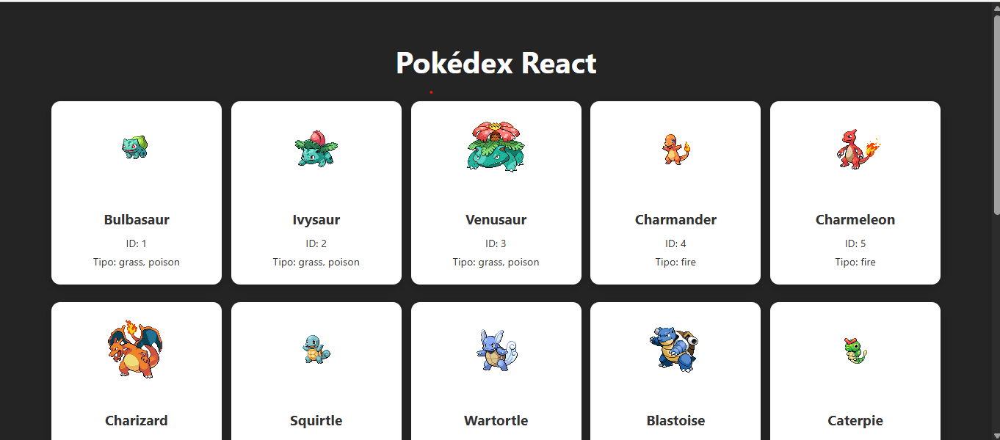

# Pokédex React App

A responsive and visually polished Pokédex web application built with React and CSS. It displays a grid of Pokémon cards with images, types, and IDs, using data from the PokéAPI. Designed with clean layout, hover effects, and modular components.

---

## Demo

  

---

## Features

- Pokémon Grid: Displays a responsive grid of Pokémon cards with name, image, ID, and types.
- API Integration: Fetches data from the PokéAPI and displays detailed Pokémon info.
- Hover Effects: Cards animate slightly on hover for a smooth user experience.
- CSS-Only Styling: All layout and design handled with pure CSS (no Tailwind or frameworks).
- Modular Components: Built with reusable React components for scalability.
- Error and Loading States: Handles API errors and loading feedback gracefully.
- Clean and Centered Layout: Cards are centered and spaced evenly across screen sizes.

---

## How to Use

- Open the app in your browser.
- Scroll through the grid to view Pokémon cards.
- Hover over a card to see the animation.
- (Optional) Extend the app to show Pokémon details on click or add pagination.

---

## Technologies Used

- React (Vite)
- TypeScript
- CSS3
- Axios
- PokéAPI

---

## Getting Started

### Prerequisites

- Node.js and npm installed
- Modern web browser (Chrome, Firefox, Edge, Safari)

### Setup

1. Clone the repository:

```bash
git clone https://github.com/your-username/pokedex-react.git
cd pokedex-react
